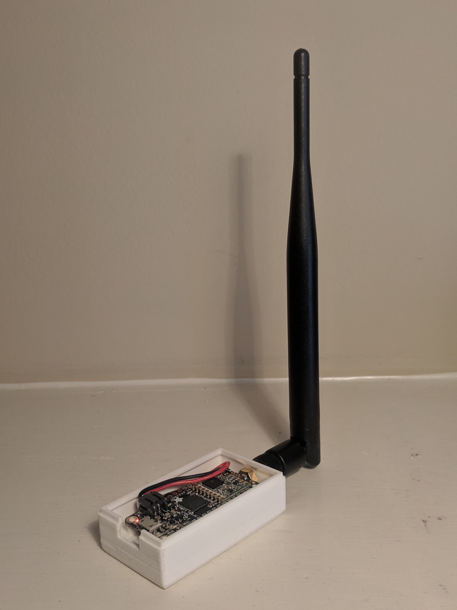
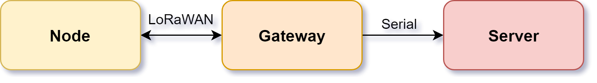

# MeasureMesh
LoRa based wireless measurement system and analytics interface

[Presentation Video](https://www.youtube.com/watch?v=1ulXspFDftA&t=3s)
[Demonstation Video](https://www.youtube.com/watch?v=nNw1X1mAYoE&t=2s)

## Node with custom enclosure
 

## Gateway

## System Diagram

See the data plotted [here](http://ruffner.ddns.net/measure-mesh/Server).

Final project for IoT HW/SW Design at the University of Kentucky.

### Parts:
- [Adafruit RFM95 Feather](https://www.adafruit.com/product/3078)
- [Adafruit RFM95 BOB](https://www.adafruit.com/product/3072)
- [Adafruit 350mAh LiPo](https://www.adafruit.com/product/2750)
- [Adafruit 915 Mhz Antenna](https://www.adafruit.com/product/3340)
- ESP8266 Breakout

### Libraries
- [PJRC RadioHead Library](https://github.com/PaulStoffregen/RadioHead)

### CAD 
- Node Enclosure

### ToDo
- Gateway enclosure
