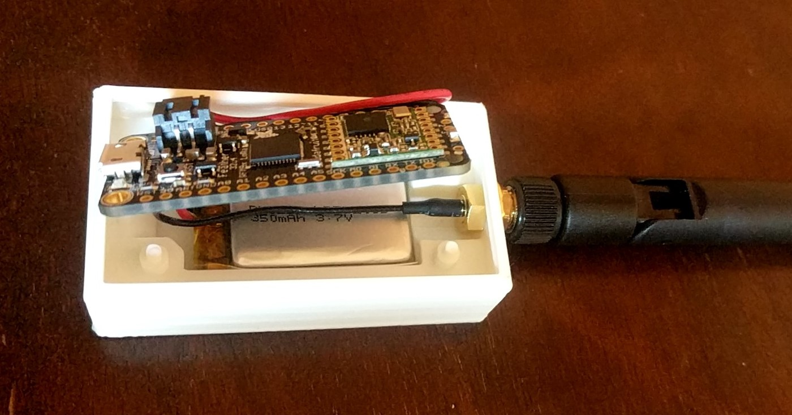
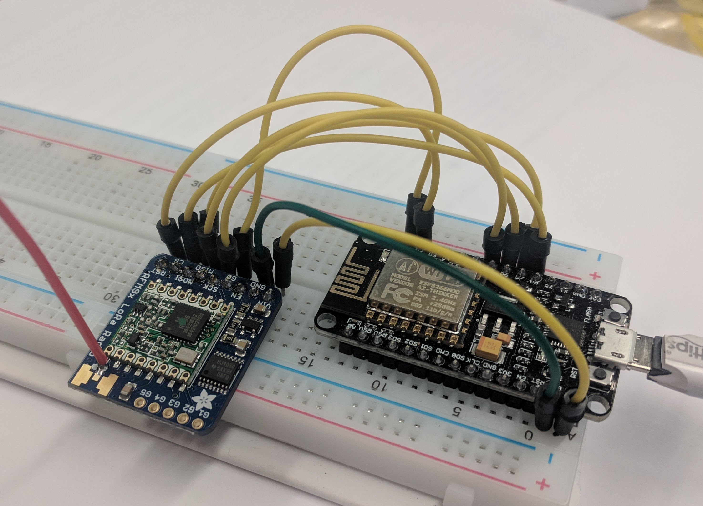

# MeasureMesh
LoRa based wireless measurement system and analytics interface

 

### Parts:
- (Adafruit RFM95 Feather)[https://www.adafruit.com/product/3078]
- (Adafruit RFM95 BOB)[https://www.adafruit.com/product/3072]
- (Adafruit 350mAh LiPo)[https://www.adafruit.com/product/2750]
- (Adafruit 915 Mhz Antenna)[https://www.adafruit.com/product/3340]
- ESP8266 Breakout

### Libraries
- (PJRC RadioHead Library)[https://github.com/PaulStoffregen/RadioHead]

### Hand Spun Components
- Node Enclosure

### ToDo
- Node firmware
- Gateway firmware
- Gateway enclosure
- Web backend
